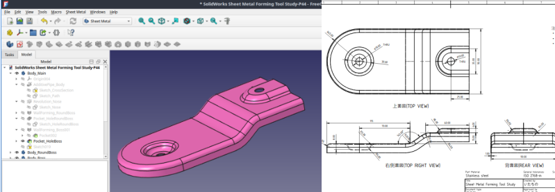

# FreeCAD板金モデリング実例 #16
## Contents

FreeCADで作成した板金モデル一式です。  

FreeCADで板金加工向けに最適化し、展開しやすい形状に調整しています。
3Dモデル・図面・展開図（DXF）を含みます。

データは Git を使わなくても、
右上の「Code」→「Download ZIP」からダウンロードできます。

※ このプロジェクトは[noteの記事](https://note.com/clever_poppy9517/n/n6aff7237b761)と連動しています。

## Environment

- FreeCAD 1.1.1
- Sheet Metal Workbench 0.8.22

## Source Reference

この作品は以下の動画を参考にしています：
- YouTube: CAD CAM TUTORIAL BY MAHTABALAM  
  [SolidWorks Sheet Metal Forming Tool Study](https://www.youtube.com/watch?v=BeEJwAohwro)

## Contact

板金モデル作成のご相談は、noteまたはXからご連絡ください。
- [https://note.com/clever_poppy9517](https://note.com/clever_poppy9517)
- [https://x.com/itaqino](https://x.com/itaqino)
